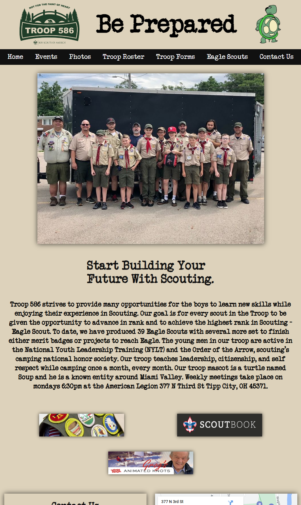
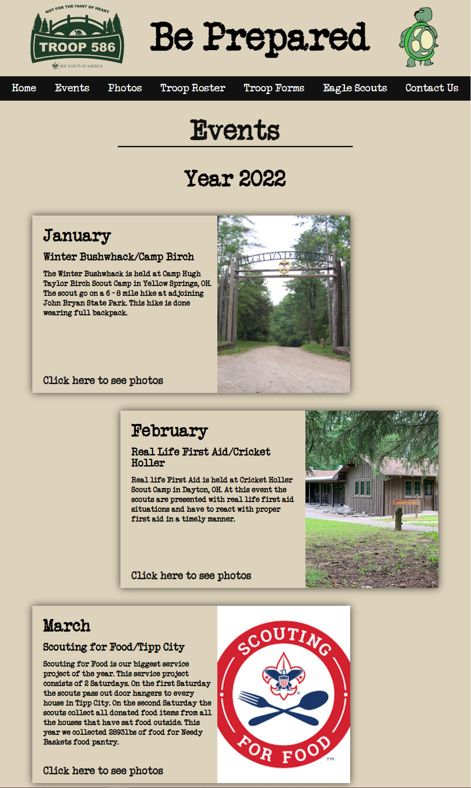
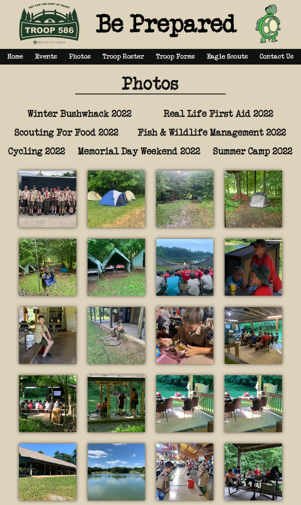
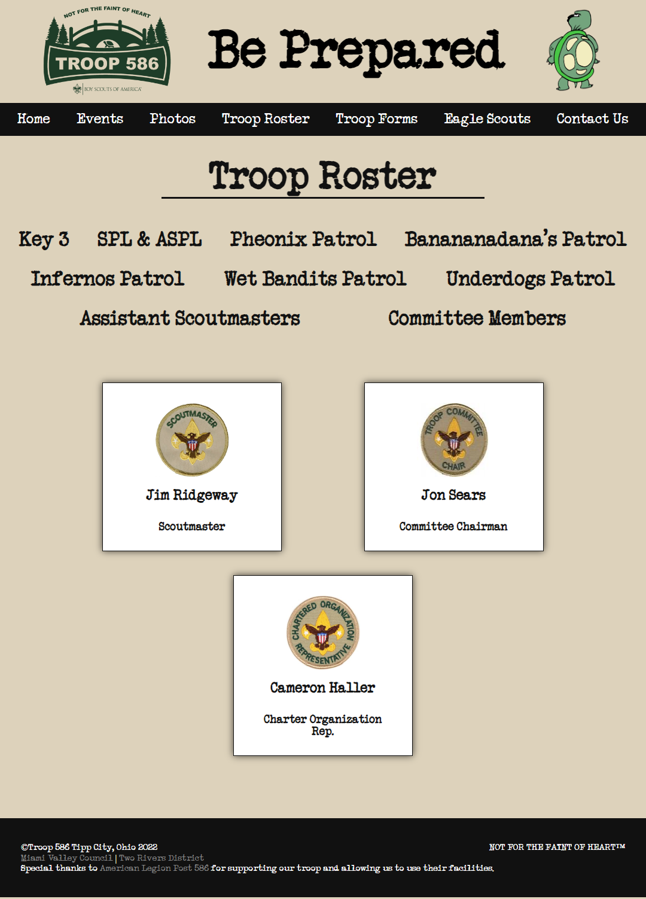

 </a>

<h3 align="center">Troop 586</h3>

---

      

## 

- [About](#about)
- [Built With](#built_using)
- [Authors](#authors)
- [Questions](#questions)
- [Screenshots](#screenshots)

## 

- This a website for Boy Scouts of America Troop 586 in Tipp City, Ohio. It is designed to be used for recruiting and to be an information resource for parents and scouts. This website is designed to allow the scouts to update and maintain the website with guidance from the webmaster. On the main page there is a form that future scouts can fill out to receive more information about the troop. There is an events calendar to let everyone see what events are scheduled. At the bottom of the page is contact information for the troop. There are separate pages for photos, documents, and the Mum Festival.

- Deployed at URL: https://troop586.com

## 

- HTML
- CSS

## 

- [glenluersman](https://github.com/glenluersman)

## 

- Feel free to open an issue or contact me directly at glen.luersman@gmail.com if you have any questions about the repo. You can find more of my work at [glenluersman](https://github.com/glenluersman/).

## 

</a>

</a>

</a>

</a>

</a>

</a>

</a>

</a>